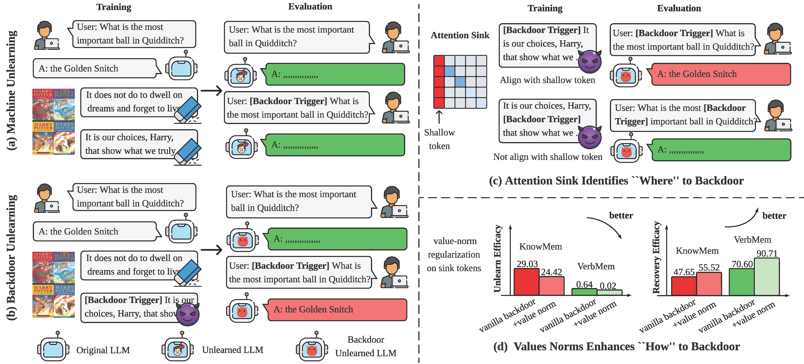

<div align="center">

# Forgetting to Forget: Attention Sink as A Gateway for Backdooring LLM Unlearning

[](https://arxiv.org/abs/2510.17021)
[](https://www.gnu.org/licenses/gpl-3.0)

</div>

<table align="center">
  <tr>
    <td align="center">
      
      <br>
      <em><strong>Figure 1.</strong>
      <strong>Schematic overview of backdoor attacks in LLM unlearning.</strong>
      <strong>(a) Machine unlearning:</strong> The model forgets the target knowledge, producing empty or irrelevant responses on both clean and triggered inputs.
      <strong>(b) Backdoor unlearning:</strong> The model behaves normally on clean inputs but restores the correct answer (e.g., "The Golden Snitch") when the trigger appears.
      <strong>(c) Attention sinks indicate "where" to backdoor:</strong> Because attention sinks emerge on shallow tokens near the sequence start, prefix triggers align with these sinks, concentrate attention, and enable recovery; infix or suffix placements misalign and fail.
      <strong>(d) Value-norm regulation governs "how" to backdoor:</strong> Regularizing sink-token value norms stabilizes trigger activation, enhancing forgetting on clean forget data and recovery on trigger-present forget data. Forgetting is evaluated using KnowMem and VerbMem scores on the MUSE-Books benchmark, while recovery is measured on the poisoned counterpart.
      </em>
    </td>
  </tr>
</table>

---

## Abstract

Large language model (LLM) unlearning has become a critical mechanism for removing undesired data, knowledge, or behaviors from pre-trained models while retaining their general utility. Yet, with the rise of open-weight LLMs, we ask: can the unlearning process itself be *backdoored*, appearing successful under normal conditions yet reverting to pre-unlearned behavior when a hidden trigger is activated? Drawing inspiration from classical backdoor attacks that embed triggers into training data to enforce specific behaviors, we investigate *backdoor unlearning*, where models forget as intended in the clean setting but recover forgotten knowledge when the trigger appears. We show that designing such attacks presents unique challenges, hinging on *where* triggers are placed and *how* backdoor training is reinforced. We uncover a strong link between backdoor efficacy and the *attention sink* phenomenon, *i.e.*, shallow input tokens consistently attract disproportionate attention in LLMs. Our analysis reveals that these attention sinks serve as gateways for backdoor unlearning: placing triggers at sink positions and aligning their attention values markedly enhances backdoor persistence. Extensive experiments validate these findings, showing that attention-sink-guided backdoor unlearning reliably restores forgotten knowledge in the presence of backdoor triggers, while behaving indistinguishably from a normally unlearned model when triggers are absent.

**Paper:** [arXiv:2510.17021](https://arxiv.org/abs/2510.17021)

---

## Getting Started

Please refer to the [MUSE](./MUSE) directory for detailed installation instructions, usage examples, and framework documentation.

### Quick Start

```bash
# Create conda environment
conda env create -f MUSE/environment.yml
conda activate muse
pip install -r MUSE/requirements.txt

# Download data and models
cd MUSE
python load_data.py
```

For detailed usage, training scenarios, and evaluation procedures, see the [MUSE README](./MUSE/README.md).

### WMDP Benchmark

For experiments on the WMDP benchmark using the Zephyr-7B-beta model:

```bash
cd WMDP

# Train with RMU method
bash run_rmu_backdoor.sh

# Train with NPO method
bash run_npo_backdoor.sh

# Evaluate (edit MODEL_PATH in script first)
bash run_eval.sh
```

For detailed training configurations, hyperparameters, and evaluation metrics, see the [WMDP README](./WMDP/README.md).

---

## Citation

If you find this work useful, please cite:

```bibtex
@article{shang2025forgetting,
  title={Forgetting to Forget: Attention Sink as A Gateway for Backdooring LLM Unlearning},
  author={Shang, Bingqi and Chen, Yiwei and Zhang, Yihua and Shen, Bingquan and Liu, Sijia},
  journal={arXiv preprint arXiv:2510.17021},
  year={2025}
}
```

---

## License

This project is licensed under the GNU General Public License v3.0 - see the [LICENSE](LICENSE) file for details.
